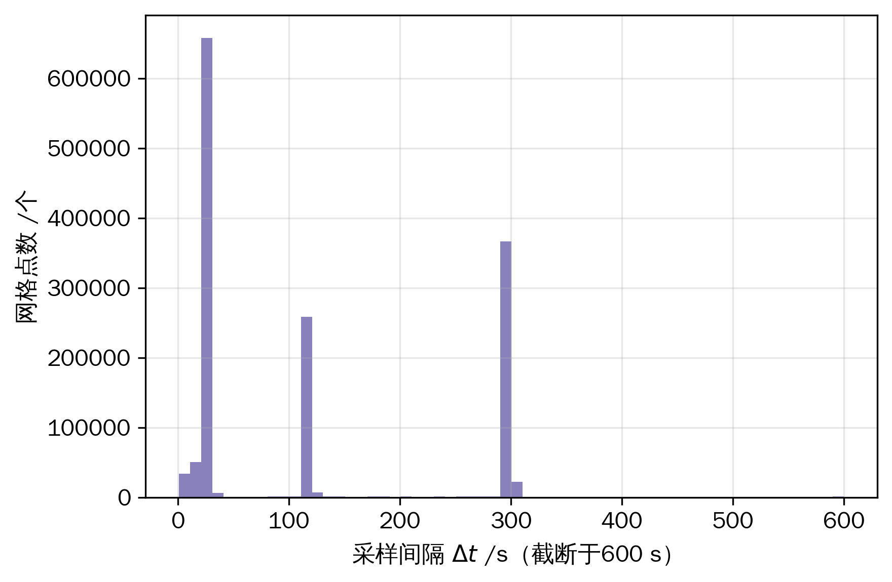
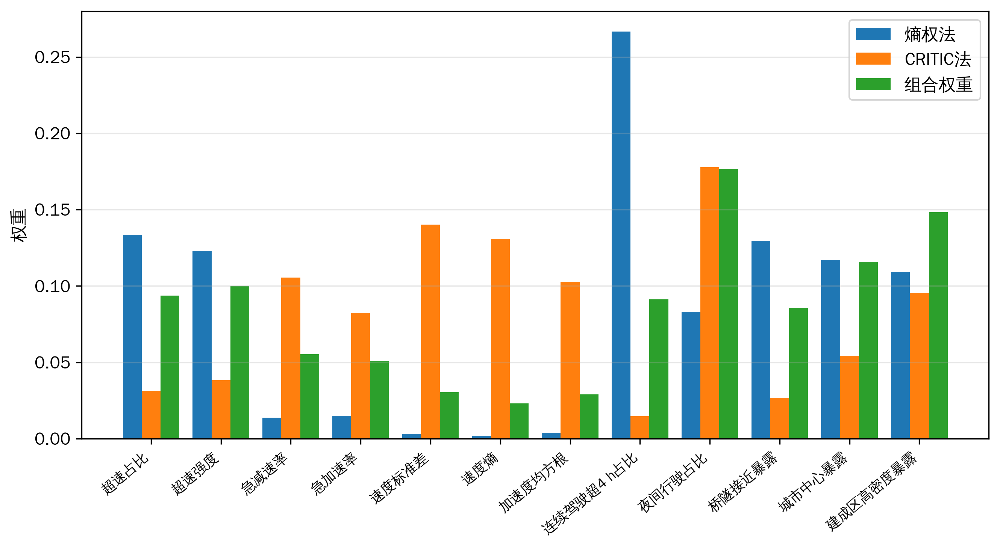
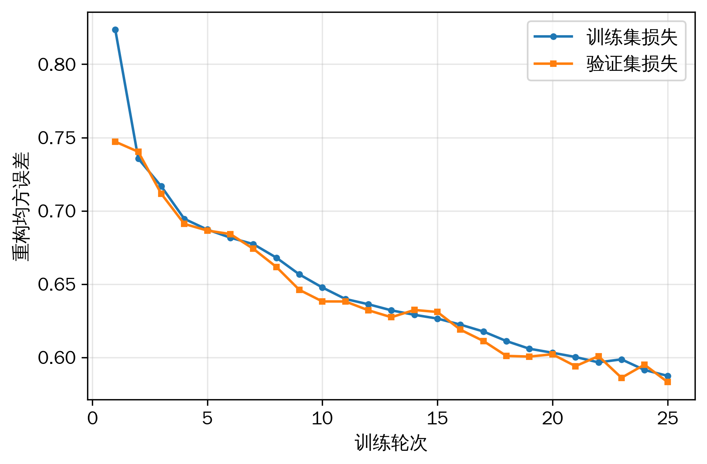
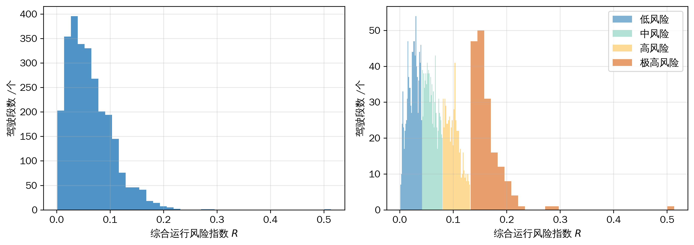
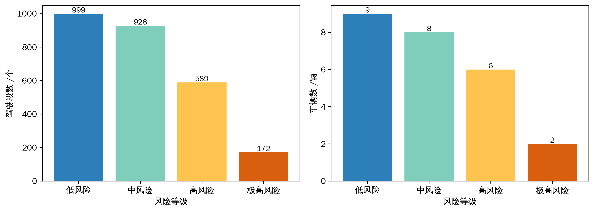
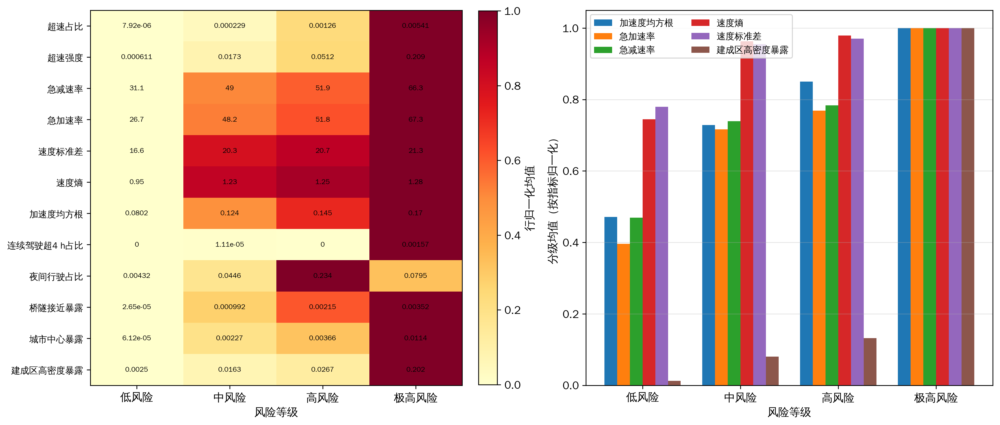
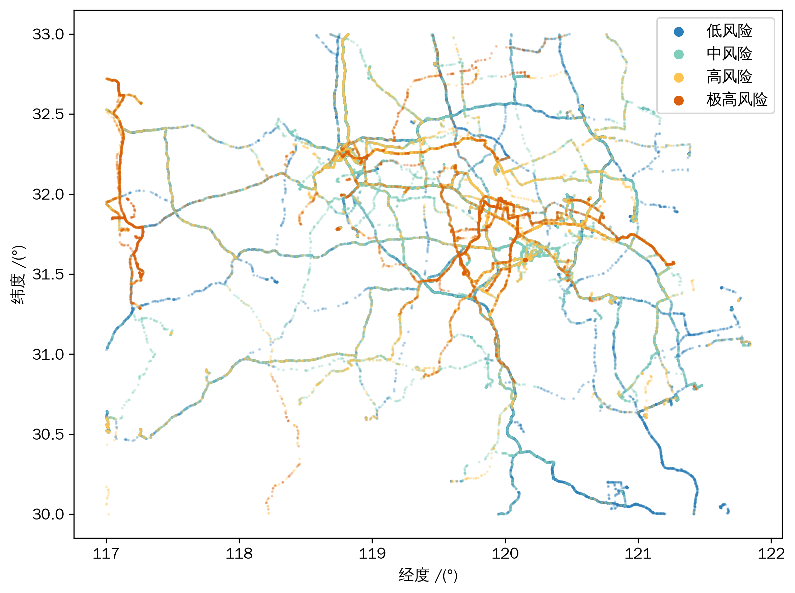
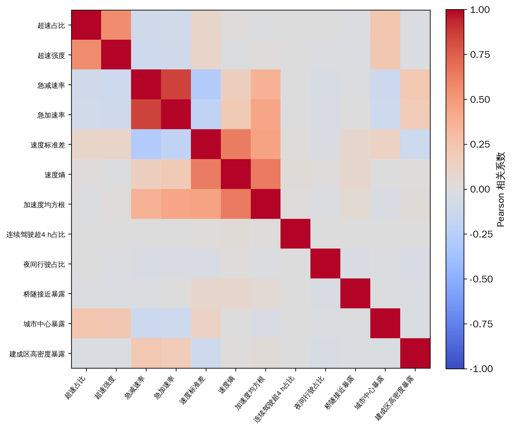

# 基于北斗短报文定位数据的危险货物运输车辆驾驶风险识别与分级方法研究

## 摘要

针对危险货物运输车辆（以下简称"危货车"）安全监管中事故与违章标签稀缺、北斗短报文（RDSS）定位数据稀疏且采样间隔不等的难题，本文提出一种融合多维替代安全指标与自监督轨迹表征的危货车驾驶风险识别与分级方法。首先，针对北斗短报文低频、不等间隔的采样特征，设计稀疏对齐与固定步长重采样流程，生成插值掩码并依据长盲区与持续停车进行驾驶段切分；其次，构建涵盖驾驶行为、监管合规与危货情境暴露三个维度、共 12 项方向统一的替代安全指标，采用熵权法与 CRITIC 法的几何平均组合赋权；再次，提出一种 Δt 感知、带掩码重构的长短期记忆（LSTM）自编码器，在无标签驾驶段序列上自监督地学习轨迹表征，并以重构误差作为异常分量；最后，通过逼近理想解排序法（TOPSIS）将加权指标分量与自监督异常分量融合为"综合运行风险指数"，并以一维 K 均值聚类实现四级风险划分。基于某区域 25 辆危货车 2024 年 1 月的 1,048,575 条真实北斗定位记录开展实验，经预处理得到 1,441,032 个重采样网格点与 2,688 个有效驾驶段。结果表明：所得风险指数在指数空间的聚类轮廓系数为 0.572；12 项替代安全指标在四个风险等级间的差异均通过 Kruskal–Wallis 检验（p<0.001），其中 10 项随等级严格单调递增，表明分级结果具有良好的构念效度；消融实验显示综合指数与"仅指标""仅自监督"两个分量的 Spearman 相关分别为 0.708 与 0.777，二者均对最终风险排序产生实质贡献。本方法不依赖事故标签，可对驾驶风险倾向进行量化与分级，为危货运输监管提供可操作的技术支撑。

**关键词**：北斗短报文；危险货物运输；驾驶风险识别；风险分级；自监督学习；LSTM 自编码器；TOPSIS

---

## Abstract

To address the scarcity of accident/violation labels and the sparse, irregularly sampled nature of BeiDou short-message (RDSS) positioning data in the safety supervision of hazardous-materials (hazmat) transport vehicles, this paper proposes a driving-risk identification and grading method that fuses multi-dimensional surrogate safety indicators with self-supervised trajectory representations. A sparse-alignment and fixed-step resampling procedure is designed for the low-frequency, irregular sampling of BeiDou short messages, producing interpolation masks and segmenting driving sessions by long blind gaps and sustained stops. A 12-indicator surrogate safety system spanning driving behavior, regulatory compliance, and hazmat contextual exposure is then constructed, with weights obtained by a geometric-mean combination of the entropy-weight and CRITIC methods. A Δt-aware LSTM autoencoder with masked reconstruction learns trajectory representations self-supervised from unlabeled driving-session sequences, and its reconstruction error serves as an anomaly component. Finally, TOPSIS fuses the weighted indicator component and the self-supervised anomaly component into a composite operating-risk index, and a one-dimensional K-means clustering yields a four-level risk grading. Experiments on 1,048,575 real BeiDou records from 25 hazmat vehicles (January 2024) yield 1,441,032 resampled grid points and 2,688 valid driving sessions. The risk index attains a clustering silhouette of 0.572 in index space; all 12 surrogate indicators differ significantly across the four grades (Kruskal–Wallis, p<0.001), and 10 of them increase strictly monotonically with grade, indicating strong construct validity. Ablation shows Spearman correlations of 0.708 and 0.777 between the composite index and the indicator-only / anomaly-only variants, confirming that both components contribute substantively. The method requires no accident labels and quantifies and grades driving-risk propensity, providing actionable support for hazmat-transport supervision.

**Keywords**: BeiDou short message; hazardous-materials transport; driving-risk identification; risk grading; self-supervised learning; LSTM autoencoder; TOPSIS

---

## 1 引言

危险货物运输事关公共安全，一旦发生事故往往造成重大人员伤亡、财产损失与环境污染。我国对危货车实施卫星定位强制入网监管，其中北斗短报文（RDSS）凭借在公网覆盖薄弱区域的通信能力，成为偏远路段、跨区域长途运输的重要定位回传手段。然而，受短报文通信带宽与计费机制限制，北斗短报文定位数据具有**采样频率低、采样间隔不等、长时间盲区频发**的特征，与车载 OBD/CAN 高频数据存在本质差异，给基于轨迹的驾驶风险分析带来困难。

与此同时，危货运输安全监管长期面临**标签稀缺**问题：事故为小概率事件，违章记录零散且难以与轨迹精确对齐，导致以"事故预测"为目标的监督学习范式难以落地。因此，如何在**无事故标签、稀疏不等间隔**的北斗短报文数据上，对驾驶风险倾向进行可靠的量化与分级，是当前危货运输智能监管亟待解决的问题。

本文不以直接预测事故概率为目标，而是从**风险识别、风险倾向量化与风险等级划分**的角度出发，提出一套面向北斗短报文数据特征的完整方法，主要贡献如下：

1. **面向稀疏不等间隔数据的预处理范式**：设计稀疏对齐—固定步长重采样—插值掩码—长盲区/持续停车驾驶段切分流程，将原始不规则报文转化为可分析的等步长驾驶段序列，并显式保留采样稀疏性信息（Δt 与插值掩码）。
2. **多维替代安全指标体系与组合赋权**：在无事故标签条件下，构建驾驶行为、监管合规、危货情境暴露三维、共 12 项方向统一的替代安全指标，并以熵权法与 CRITIC 法几何平均组合赋权，兼顾信息量与指标间冲突性。
3. **Δt 感知的自监督轨迹表征**：提出带掩码重构的 LSTM 自编码器，在无标签驾驶段上自监督学习轨迹表征，以重构误差刻画偏离常态的异常驾驶模式，增强对稀疏采样的鲁棒性。
4. **指标—表征融合的综合风险指数与分级验证**：用 TOPSIS 融合加权指标分量与自监督异常分量得到综合运行风险指数，经一维 K 均值实现四级划分，并从内部聚类质量、外部指标一致性、消融三方面进行系统验证。

基于 25 辆危货车一个月的真实北斗短报文数据的实验表明，本方法所得风险分级在统计上显著区分了各类替代安全指标，且指标与自监督两类信息均对风险排序产生实质贡献，方法整体可复现、可解释、可落地。

---

## 2 相关工作

**驾驶风险量化**。既有研究多基于高频车载数据（CAN/OBD、IMU、视频）提取急加速、急减速、急转弯等事件，结合驾驶员行为构建风险评分。此类方法依赖高采样率与丰富传感通道，难以直接迁移至带宽受限、低频回传的北斗短报文场景。

**危货运输安全**。危货运输研究关注路径选择、风险暴露（人口、环境敏感目标）、应急响应等，多在路网或 GIS 层面进行宏观风险评估，较少在个体车辆—驾驶段尺度上结合实际运行轨迹刻画驾驶风险。

**稀疏/不等间隔时间序列建模**。针对不规则采样，已有时间间隔嵌入、掩码重构、神经常微分方程等方法。本文借鉴时间间隔（Δt）显式建模与掩码自监督思想，但面向北斗短报文的工程特征进行适配，并与替代安全指标体系融合。

**多指标综合评价**。熵权法、CRITIC、TOPSIS 等在交通安全综合评价中应用广泛。本文在客观组合赋权基础上，进一步引入自监督异常分量，使综合评价兼顾"可解释的规则化指标"与"数据驱动的异常模式"。

综上，面向北斗短报文这一特定数据形态、在无事故标签条件下融合替代安全指标与自监督表征的驾驶风险识别与分级方法尚不多见，本文对此进行探索。

---

## 3 数据与问题描述

### 3.1 数据集

实验数据为某区域 25 辆危货车 2024 年 1 月 1 日至 28 日的北斗短报文定位记录，共 1,048,575 条。每条记录包含车牌标识、瞬时速度（km/h）、经度、纬度、累计里程（km）与定位时刻。车辆活动空间以苏皖沿江地区（南京—扬州—镇江—常州—无锡—苏州一带）为主，并含跨省长途运输。

数据呈现典型北斗短报文特征：速度被监管限速封顶于 0–85 km/h，均值约 28.3 km/h，中位数约 11 km/h，速度为零（停车/装卸）记录占 48.7%；相邻报文采样间隔中位数约 30 s，90 分位约 120 s，99 分位约 300 s，并存在长达数十小时的长盲区。图 1 给出采样间隔分布，直观反映其稀疏与不等间隔特征。

**图 1** 北斗短报文采样间隔（Δt）分布（截断于 600 s）

### 3.2 问题描述

记车辆集合为 $V=\{v_1,\dots,v_{25}\}$。对车辆 $v$，其原始报文序列为 $\{(t_i,\mathbf{p}_i,s_i,m_i)\}$，其中 $t_i$ 为时刻、$\mathbf{p}_i=(\text{lon}_i,\text{lat}_i)$ 为位置、$s_i$ 为速度、$m_i$ 为里程；采样间隔 $\Delta t_i=t_i-t_{i-1}$ 非定值。由于缺乏事故/违章标签，本文目标并非学习 $P(\text{事故}\mid \text{轨迹})$，而是：

- **风险识别**：识别偏离常态、具有更高风险倾向的驾驶段；
- **风险量化**：为每个驾驶段计算可比较的综合运行风险指数 $R\in[0,1]$；
- **风险分级**：将驾驶段与车辆划分为有序的风险等级，并验证其与替代安全指标的一致性。

---

## 4 方法

方法整体流程如图所示，包含预处理（S1–S4）、多维替代安全指标与组合赋权（S5–S7）、自监督轨迹表征（S8 表征）、TOPSIS 融合与综合风险指数（S8 融合）、风险分级与验证（S9）等环节。

### 4.1 数据接入与清洗（S1–S2）

统一字段与编码（原始为 GBK），解析日期与定位时刻合成时间戳；剔除位置越界（经度 73°–135°、纬度 3°–54° 之外）、速度越界（<0 或 >100 km/h）、关键字段缺失记录；对同一车辆同一时刻去重；按车辆—时间排序。进一步剔除相邻点位移异常跳变（位移 > 5 km 且等效时速 > 150 km/h），以抑制定位野值。

### 4.2 稀疏对齐与重采样（S3）

为消除采样间隔不等的影响，对每辆车按长盲区阈值 $\tau_g=600$ s 将序列切分为若干连续段；段内以固定步长 $\Delta=30$ s 重采样，对经度、纬度、速度、里程做线性插值，得到等步长网格序列。同时生成两类稀疏性信息：

- **插值掩码** $\text{mask}_k\in\{0,1\}$：网格点 $k$ 的 $\pm\Delta/2$ 邻域内是否存在原始观测；
- **局部采样间隔** $\text{gap}_k$：网格点所处原始采样间隔，刻画局部稀疏程度。

长盲区不进行跨段插值，从而避免在无观测区间制造虚假轨迹。

### 4.3 驾驶段切分（S4）

危货监管要求"连续驾驶不超过 4 h、之后须休息不少于 20 min"。据此，将持续停车（速度 < 2 km/h）时长不小于 20 min 视为一次合规休息，并以此切分**驾驶段**（两次合规休息之间的连续驾驶）；短时停车（如等灯、短暂装卸）并入相邻驾驶段。过滤时长不足 5 min 或里程不足 1 km 的无效段。该定义使驾驶段与监管"连续驾驶"单元对齐，便于直接评估连续驾驶合规性。

经上述处理，25 辆车共得到 **1,441,032** 个重采样网格点、**2,688** 个有效驾驶段，覆盖总里程约 18.5 万 km。

### 4.4 多维替代安全指标体系（S5）

在无事故标签条件下，以"可观测、可解释、与安全相关"为原则，构建三维共 12 项替代安全指标，方向统一为"数值越大风险越高"：

**（1）驾驶行为类**
- 超速占比 `overspeed_ratio`：速度超过限速（80 km/h）的网格点占比；
- 超速强度 `overspeed_intensity`：超速时段的平均超速量（km/h）；
- 急减速率 `hard_brake_rate`、急加速率 `hard_accel_rate`：受北斗短报文 30 s 级采样限制，瞬时加减速度不可观测，故以"单个采样间隔内速度突变 ≥ 15 km/h"作为可观测替代事件，且仅在密采样步（$\Delta t\le 60$ s）上计数，按每 100 km 归一，避免跨长插值段的伪事件；
- 速度标准差 `speed_std`、速度熵 `speed_entropy`：刻画速度波动与不确定性；
- 加速度均方根 `acc_rms`：基于等步长速度差分的纵向平稳性度量。

**（2）监管合规类**
- 连续驾驶超 4 h 时间占比 `continuous_over4h_ratio`：驾驶段超过 4 h 部分的时间占比；
- 夜间行驶占比 `night_ratio`：22:00–06:00 时段网格点占比。

**（3）危货情境暴露类**
- 跨江桥隧接近暴露 `bridge_tunnel_exposure`：网格点位于研究区已知跨江大桥/隧道 1 km 缓冲内的占比；
- 城市中心接近暴露 `city_exposure`：位于主要城市中心 5 km 缓冲内的占比；
- 建成区高密度暴露 `density_exposure`：基于轨迹点自身网格化点密度（取 90 分位为阈）识别的高密度（建成区代理）区域占比。

各指标先在驾驶段尺度计算，再以里程为权重聚合到车辆尺度。

### 4.5 标准化与组合赋权（S6–S7）

所有指标均为正向，采用极差（min–max）标准化至 $[0,1]$。为降低单一客观赋权的偏倚，结合两种互补方法：**熵权法**度量各指标的信息量（离散程度），**CRITIC** 法兼顾对比强度（标准差）与指标间冲突性（$1-$相关）。最终权重取二者几何平均后归一：

$$
w_j=\frac{\sqrt{w_j^{\text{ent}}\,w_j^{\text{cri}}}}{\sum_l \sqrt{w_l^{\text{ent}}\,w_l^{\text{cri}}}}.
$$

所得权重见图 2 与表 1。组合赋权下，夜间行驶占比、建成区高密度暴露、城市中心接近暴露、超速强度等指标权重较高，符合危货运输安全的先验认知。

**图 2** 替代安全指标权重（熵权法 / CRITIC / 组合）

**表 1** 替代安全指标组合权重

| 指标 | 熵权 | CRITIC | 组合权重 |
|---|---|---|---|
| overspeed_ratio（超速占比） | 0.134 | 0.031 | 0.094 |
| overspeed_intensity（超速强度） | 0.123 | 0.038 | 0.100 |
| hard_brake_rate（急减速率） | 0.014 | 0.105 | 0.055 |
| hard_accel_rate（急加速率） | 0.015 | 0.082 | 0.051 |
| speed_std（速度标准差） | 0.003 | 0.140 | 0.031 |
| speed_entropy（速度熵） | 0.002 | 0.131 | 0.023 |
| acc_rms（加速度均方根） | 0.004 | 0.103 | 0.029 |
| continuous_over4h_ratio（连续驾驶超4h占比） | 0.267 | 0.015 | 0.091 |
| night_ratio（夜间行驶占比） | 0.083 | 0.178 | 0.177 |
| bridge_tunnel_exposure（桥隧接近暴露） | 0.130 | 0.027 | 0.086 |
| city_exposure（城市中心接近暴露） | 0.117 | 0.054 | 0.116 |
| density_exposure（建成区高密度暴露） | 0.109 | 0.096 | 0.148 |

### 4.6 自监督轨迹表征：Δt 感知的掩码重构 LSTM 自编码器（S8 表征）

为在无标签条件下刻画"偏离常态"的异常驾驶模式，本文在重采样驾驶段序列上训练 LSTM 自编码器。每个时间步特征为：标准化速度、加速度、加加速度（jerk）、速度变化量，以及**采样间隔 $\Delta t$**（标准化）。其中 $\Delta t$ 作为显式特征输入，使模型感知局部采样稀疏程度（Δt 感知）；以滑动窗口（长度 32 步、步长 16 步）切分得到 28,989 个样本窗口。

编码器为单层 LSTM，将窗口编码为 16 维潜变量；解码器由潜变量重建整个窗口序列。训练时对部分时间步随机置零（掩码比例 15%）以增强对稀疏/缺失的鲁棒性（掩码重构）。损失为重构均方误差（MSE）。窗口重构误差越大，表示其轨迹模式越偏离群体常态，记为**异常分量**；将窗口误差按驾驶段聚合（均值）得到驾驶段异常分量。

图 3 为训练曲线，验证损失由 0.747 降至 0.583 并趋于平稳，表明模型有效学到了常态轨迹结构。

**图 3** 自监督 LSTM 自编码器训练曲线

### 4.7 综合运行风险指数：TOPSIS 融合（S8 融合）

将 12 项加权替代安全指标与自监督异常分量统一为正向风险准则，构成决策矩阵，采用 TOPSIS 计算每个驾驶段相对"最危险解"与"最安全解"的相对贴近度作为综合运行风险指数 $R\in[0,1]$：

$$
R_i=\frac{d_i^{-}}{d_i^{+}+d_i^{-}},
$$

其中 $d_i^{+}$、$d_i^{-}$ 分别为加权规范化后到最危险理想解、最安全理想解的欧氏距离。异常分量权重设为 $\alpha=0.3$，其余 $(1-\alpha)$ 按组合权重分配给 12 项指标。$R$ 越大表示风险倾向越高。

### 4.8 风险分级与验证（S9）

对综合风险指数分别采用**分位法**与**一维 K 均值聚类**进行四级划分（低风险/中风险/高风险/极高风险），K 均值簇按均值升序映射为有序等级。验证从三方面进行：

- **内部聚类质量**：指数空间与指标空间的轮廓系数；
- **外部一致性**：各替代安全指标在等级间的差异显著性（Kruskal–Wallis）与随等级单调性、以及指数与各指标的 Spearman 相关；
- **消融**：综合指数与"仅指标""仅自监督"两个变体的相关性与分级一致性（调整兰德指数 ARI），以验证两类信息的互补贡献。

---

## 5 实验结果与分析

### 5.1 风险指数与分级分布

图 4 给出驾驶段综合运行风险指数分布及各等级的指数分布。指数整体右偏，绝大多数驾驶段处于中低风险区间，少数驾驶段具有显著更高的风险倾向，符合危货运输"多数合规、少数高危"的实际。K 均值分级将指数划分为连续且互不重叠的四段。

**图 4** 行程级综合运行风险指数分布（左）与各风险等级的指数分布（右）

图 5 给出行程级与车辆级的等级分布。在 2,688 个驾驶段中，低/中/高/极高风险分别为 999、928、589、172 个；在 25 辆车中分别为 9、8、6、2 辆。按第 90 百分位阈值识别出 269 个高风险驾驶段，可作为监管重点核查对象。

**图 5** 行程风险等级分布（左）与车辆风险等级分布（右）

### 5.2 分级有效性验证

**内部聚类质量**。综合风险指数空间的聚类轮廓系数为 0.572，表明四级划分在指数维度上分离良好；指标空间轮廓系数为 0.047，反映原始 12 维指标空间高度重叠、单指标难以直接分级，从而凸显综合指数的必要性。

**外部一致性**。如图 6 与表 2 所示，全部 12 项替代安全指标在四个风险等级间的差异均通过 Kruskal–Wallis 检验（p<0.001），其中 10 项随等级严格单调递增；指数与急加速率、急减速率、加速度均方根、速度熵等行为指标的 Spearman 相关较强（如 `acc_rms` 达 0.730）。这表明：风险等级越高的驾驶段，确实表现出更剧烈的速度波动、更频繁的速度突变与更高的暴露占比，分级结果具有良好的构念效度。需要指出的是，连续驾驶超 4h 占比与夜间行驶占比两项未呈严格单调：前者因合规性总体良好（仅 3 个驾驶段触发连续驾驶超 4h）、取值高度稀疏，其 Spearman 相关较弱（0.038）但组间差异仍显著；后者在高风险等级出现峰值而在极高风险等级回落，反映极高风险更多由速度突变与建成区暴露主导，符合多因素耦合的实际。

**图 6** 分级外部一致性：替代安全指标随风险等级的变化（左：分级归一化均值热力图；右：代表性指标）

**表 2** 各风险等级的部分指标均值与显著性

| 指标 | 低风险 | 中风险 | 高风险 | 极高风险 | Spearman ρ | Kruskal p |
|---|---|---|---|---|---|---|
| acc_rms（加速度均方根） | 0.080 | 0.124 | 0.145 | 0.170 | 0.730 | <0.001 |
| hard_accel_rate（急加速率/100km） | 26.7 | 48.2 | 51.8 | 67.3 | 0.452 | <0.001 |
| hard_brake_rate（急减速率/100km） | 31.1 | 49.0 | 51.9 | 66.3 | 0.395 | <0.001 |
| speed_entropy（速度熵） | 0.950 | 1.229 | 1.249 | 1.276 | 0.473 | <0.001 |
| speed_std（速度标准差） | 16.6 | 20.3 | 20.7 | 21.3 | 0.304 | <0.001 |
| night_ratio（夜间行驶占比） | 0.004 | 0.045 | 0.234 | 0.080 | 0.261 | <0.001 |
| density_exposure（建成区高密度暴露） | 0.003 | 0.016 | 0.027 | 0.202 | 0.151 | <0.001 |
| overspeed_intensity（超速强度） | 0.001 | 0.017 | 0.051 | 0.209 | 0.213 | <0.001 |

图 7 进一步给出核心研究区轨迹点的风险等级空间分布。高风险（橙红）主要集中于城市建成区与若干主干通道交汇处，低风险（蓝）多见于高速公路与城郊路段，与建成区高密度暴露、城市中心接近暴露等指标的空间含义一致。

**图 7** 核心研究区轨迹点风险等级空间分布（苏皖沿江）

### 5.3 消融分析

为验证"加权指标"与"自监督异常"两类信息的互补性，比较综合指数与两个变体的关系：综合指数与"仅指标"变体的 Spearman 相关为 0.708、分级 ARI 为 0.158；与"仅自监督"变体的 Spearman 相关为 0.777、分级 ARI 为 0.328。结果表明：两类信息均与最终风险排序高度相关，但任一单独分量都无法完全决定综合分级（ARI 显著小于 1），说明 TOPSIS 融合确实整合了规则化指标与数据驱动异常两方面的互补信息；自监督异常分量的引入对最终分级产生了实质性的、不可被指标完全替代的影响。

此外，分位法与 K 均值两种分级方案高度一致（Spearman 0.917、ARI 0.510），说明分级结果对划分方法不敏感，具有稳健性。

### 5.4 指标相关性

图 8 为 12 项替代安全指标的相关性矩阵。可见急加速率与急减速率、速度标准差与加速度均方根等存在中等正相关，而暴露类指标与行为类指标相关较弱、信息互补，支持采用 CRITIC 等考虑冲突性的赋权方法。

**图 8** 替代安全指标相关性矩阵

---

## 6 讨论

**方法学意义**。本文方法不依赖事故标签，将"风险"操作化为可观测的替代安全指标与数据驱动的轨迹异常，规避了危货运输事故标签稀缺导致的监督学习困境；同时通过显式 Δt 建模与掩码重构，使表征学习适配北斗短报文的稀疏不等间隔特征。

**应用价值**。综合运行风险指数与四级分级可直接服务于差异化监管：对极高/高风险车辆（如本实验识别出的 2 辆极高风险车）实施重点监控与约谈，对高风险驾驶段（如夜间穿越建成区、连续驾驶时长偏长、速度突变频繁的行程）进行预警与核查，从而将有限监管资源投向高风险对象。

**与监管规则的契合**。连续驾驶超 4 h 占比指标显示，在以 20 min 合规休息切分的 2,688 个驾驶段中，仅 3 个驾驶段存在连续驾驶超 4 h 的情形，整体连续驾驶合规性较好；该指标虽触发频次低，但具有明确监管含义，熵权法亦因其稀有而赋予较高信息量权重。

**局限与未来工作**。其一，危货情境暴露依赖敏感目标图层，本文在缺乏权威 POI/GIS 数据时采用"研究区已知跨江桥隧、主要城市中心 + 数据驱动点密度"作为近似代理，可能低估或错配部分敏感目标暴露，后续应接入权威危货专用敏感目标（隧道、桥梁、学校、医院、水源地、人口密集区）图层。其二，30 s 级采样无法观测真正的瞬时急加减速，本文以采样间隔内速度突变作为可观测替代，未来可结合具备高频段的混合数据源进行校验。其三，本文为无监督/自监督范式，缺乏事故"金标准"外部验证，后续可在获得稀疏事故/违章记录后开展半监督校验与阈值标定。其四，样本为 25 辆车一个月数据，规模有限，结论的普适性有待在更大规模、跨区域数据上检验。

---

## 7 结论

本文面向北斗短报文定位数据稀疏、不等间隔与事故标签稀缺的现实约束，提出并实现了一套危货车驾驶风险识别与分级方法：以稀疏对齐重采样与驾驶段切分适配数据特征，以三维 12 项替代安全指标与熵权—CRITIC 组合赋权刻画可解释风险，以 Δt 感知的掩码重构 LSTM 自编码器自监督地提取轨迹异常，并经 TOPSIS 融合为综合运行风险指数与四级分级。基于 25 辆危货车 2024 年 1 月真实数据的实验表明，所得分级在内部聚类质量、外部指标一致性与消融分析上均表现良好：12 项指标在各等级间差异显著（p<0.001）且其中 10 项随等级严格单调递增，指标与自监督两类信息互补贡献。本方法可复现、可解释、可落地，为危货运输的差异化、精准化安全监管提供了有效的技术途径。

---

## 参考文献

> 投稿期刊：《科学技术与工程》。以下为顺序编码制参考文献，中文文献附英文译文；最终投稿前请核对各条卷期页码。

[1] 周荣义, 林金玉, 刘勇. 危险货物道路运输风险评估的集对模型及应用[J]. 中国安全科学学报, 2019, 29(1): 173-179.

[2] 马晓丽, 倪安宁, 谢晓忠, 等. 城市道路危险货物运输风险评估[J]. 中国安全科学学报, 2018, 28(5): 178-183.

[3] 闫胜煜, 郝佳琪, 刘洋, 等. 基于熵权-TOPSIS的省域道路货运企业运营安全评估方法[J]. 重庆交通大学学报(自然科学版), 2025, 44(8): 116-122.

[4] 武荣, 陈少阳, 崔华. 基于熵TOPSIS模型的大宗货物运输方式综合评价[J]. 重庆理工大学学报(自然科学), 2022, 36(6): 254-260.

[5] 欧阳中辉, 樊辉锦, 陈青华, 等. 基于北斗短报文的特种车辆状态信息压缩传输方法研究[J]. 兵器装备工程学报, 2020, 41(9): 124-129.

[6] Hwang C L, Yoon K. Multiple attribute decision making: methods and applications[M]. Berlin: Springer-Verlag, 1981: 58-191.

[7] Diakoulaki D, Mavrotas G, Papayannakis L. Determining objective weights in multiple criteria problems: the CRITIC method[J]. Computers & Operations Research, 1995, 22(7): 763-770.

[8] Shannon C E. A mathematical theory of communication[J]. The Bell System Technical Journal, 1948, 27(3): 379-423.

[9] Hochreiter S, Schmidhuber J. Long short-term memory[J]. Neural Computation, 1997, 9(8): 1735-1780.

[10] Che Z, Purushotham S, Cho K, et al. Recurrent neural networks for multivariate time series with missing values[J]. Scientific Reports, 2018, 8: 6085.

[11] Malhotra P, Ramakrishnan A, Anand G, et al. LSTM-based encoder-decoder for multi-sensor anomaly detection[C]//Proceedings of the ICML 2016 Anomaly Detection Workshop. New York: ICML, 2016: 1-5.

[12] Vaswani A, Shazeer N, Parmar N, et al. Attention is all you need[C]//Advances in Neural Information Processing Systems 30. Long Beach: Curran Associates, 2017: 5998-6008.

[13] Kingma D P, Ba J. Adam: a method for stochastic optimization[C]//Proceedings of the 3rd International Conference on Learning Representations. San Diego: ICLR, 2015: 1-15.

[14] Rousseeuw P J. Silhouettes: a graphical aid to the interpretation and validation of cluster analysis[J]. Journal of Computational and Applied Mathematics, 1987, 20: 53-65.

[15] Hubert L, Arabie P. Comparing partitions[J]. Journal of Classification, 1985, 2(1): 193-218.

[16] Kruskal W H, Wallis W A. Use of ranks in one-criterion variance analysis[J]. Journal of the American Statistical Association, 1952, 47(260): 583-621.

[17] Hermans E, Brijs T, Wets G, et al. Benchmarking road safety: lessons to learn from a data envelopment analysis[J]. Accident Analysis & Prevention, 2009, 41(1): 174-182.

[18] 交通运输部. 道路运输车辆动态监督管理办法[S]. 北京: 交通运输部, 2022.

---

### 附：实验复现说明

- 代码位于 `src/`，一键运行：`python -m src.run_pipeline`（首次运行含预处理；`--use-cache` 复用预处理缓存）。
- 关键产出：`results/tables/`（指标、权重、风险与分级、验证统计）与 `results/figures/`（论文全部图）。
- 主要环境：Python 3.12，numpy/pandas/scikit-learn/scipy/matplotlib/pytorch（CPU）。随机种子固定，结果可复现。
